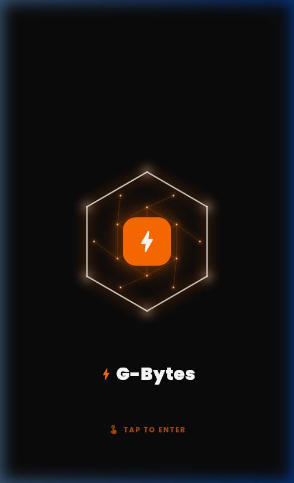
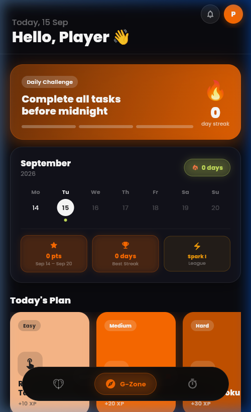
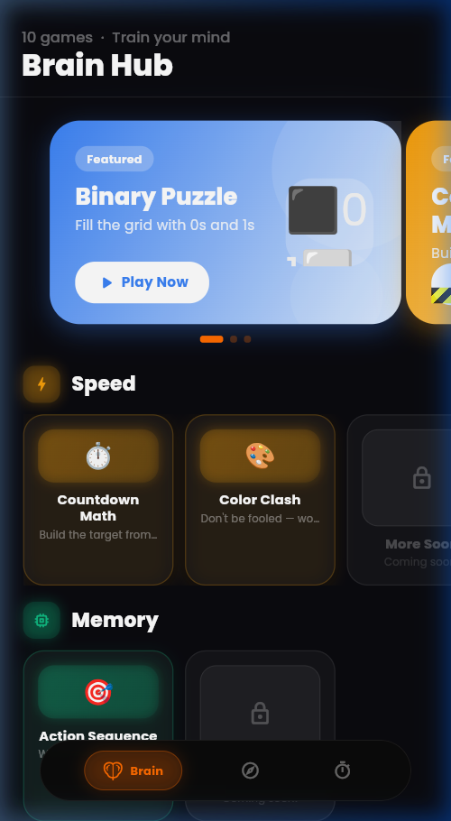
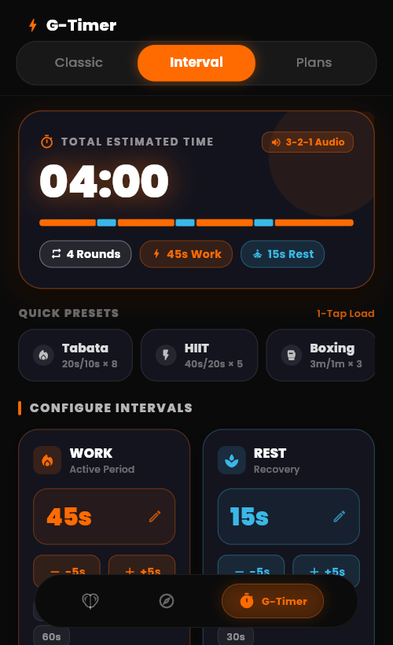
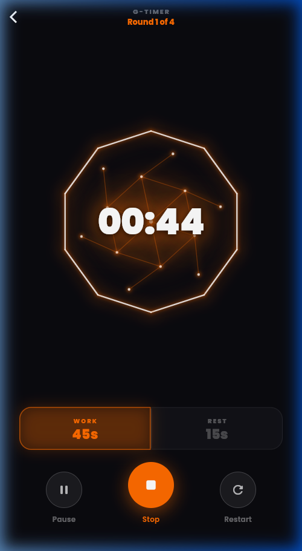
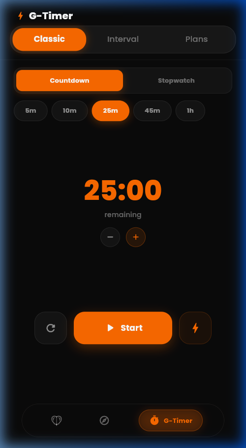

# 🧠 G-Bytes

**Train your brain, stay focused, and build lasting habits — one byte at a time.**

Brain Training • Pro Interval & Focus Timers • Habit & XP System • Distraction-Free UX

---

## 📱 Download

Grab the latest Android build directly from the **[Releases](https://github.com/Asta-dev-378/G-Bytes/releases)** page — ready to install with zero setup:

1. Visit the **[Releases](https://github.com/Asta-dev-378/G-Bytes/releases)** section of this repository.
2. Download the latest `app-release.apk` file.
3. On your Android device, enable **Install from unknown sources** if prompted.
4. Open the APK to launch G-Bytes.

> **Note:** Windows Desktop and Web builds may also be provided on the Releases page depending on the release version.

---

## 🎬 App Experience

  
  
<em>Fluid athletic transitions • Synchronized audio coaching • Zero scrollbar clutter</em>

---

## 📸 Visual Showcase

### ⚡ Core Experience & Dashboard

| 🌟 Fluid Brand Launch | 🔥 G-Zone Fitness & Habits | 🧠 Brain Hub Cognitive Suite |
| :---: | :---: | :---: |
|  |  |  |
| *Pulsing neon startup animation* | *Daily training, streaks & XP progression* | *Engaging cognitive games & exercises* |

 

### ⏱️ Pro Interval & Timer Suite

| 🎛️ Command Center Setup | ⚡ High-Intensity Work Phase | ⏱️ Classic Stopwatch |
| :---: | :---: | :---: |
|  |  |  |
| *1-tap presets (Tabata, HIIT, Boxing) & cadence bar* | *Dynamic neon progress & interval transitions* | *Precision stopwatch with lap splits & countdown* |

---

## ✨ Key Features

### ⏱️ Athletic & Pro Interval Timer Suite
Designed from the ground up for high-intensity athletes, runners, and focused workers:
- 🎛️ **Command Center Hero**: Computes total estimated workout duration in real time with an athletic typography HUD.
- 📊 **Visual Cadence Bar**: Color-coded proportional timeline depicting every work and recovery interval block at a glance.
- ⚡ **1-Tap Quick Presets**: Instant load for **Tabata** (20s/10s × 8), **HIIT** (40s/20s × 5), **Boxing** (3m/1m × 3), and **Sprint** (30s/30s × 6).
- 🎯 **Seamless Tap-to-Edit Steppers**: Direct number input dialogs alongside quick adjustment step buttons (`-5s` / `+5s`).
- 🛡️ **Distraction-Free Immersion**: Custom invisible scroll behavior (`_NoThumbScrollBehavior`) completely hides scrollbars and overscroll clutter for an ultra-clean mobile and desktop aesthetic.

### 🎮 Brain Training Mini-Games
Keep your mind sharp with an expanding collection of cognitive challenges:
- ⚡ **Speed Math**: Mental arithmetic under timed pressure.
- 🔤 **Word Wheel**: Lexical fluency and anagram resolution with a 3,000+ word dictionary.
- 🧩 **Nonogram & Akari**: Classic grid logic puzzles designed for spatial deduction.
- 🔢 **Number Maze & Balance Scale**: Numerical reasoning and logical balancing.
- 🧠 **Memory Matrix & Recall**: Short-term visual working memory tests.

### 🔥 Habits, Streaks & Gamification
- 📈 **Daily Streak Engine**: Build unbroken momentum and positive daily habits.
- ⭐ **XP & Level Progression**: Earn experience points for every game solved and workout completed.
- 🏆 **Achievement Milestones**: Unlock badges as your consistency reaches new heights.

---

## 🛠️ Tech Stack

| Category | Technology |
| :--- | :--- |
| **Framework & Language** | [Flutter](https://flutter.dev/) (Material 3) • [Dart](https://dart.dev/) `^3.11.1` |
| **State Management** | [Provider](https://pub.dev/packages/provider) architecture |
| **Navigation & Routing** | [GoRouter](https://pub.dev/packages/go_router) declarative routing |
| **UI & Animations** | Bundled Poppins typography, glassmorphism design tokens, custom responsive layout scaling |
| **Audio Engine** | [just_audio](https://pub.dev/packages/just_audio) & [audio_session](https://pub.dev/packages/audio_session) with zero-latency cues |
| **Local Persistence** | [shared_preferences](https://pub.dev/packages/shared_preferences) for offline-first data |
| **Platforms Supported** | Android, Windows Desktop, Web |

---

## 🗺️ Roadmap

- [x] High-energy voice countdown for Interval & Plan timers
- [x] Redesigned athletic command center for interval workouts
- [x] Invisible distraction-free scrollbars
- [ ] Cloud sync for cross-device streaks & progress
- [ ] iOS target deployment
- [ ] Community leaderboards & challenge leagues

---

## 📄 License

This project is licensed under the **[MIT License](LICENSE)**.

---

## 📬 Contact & Feedback

Found a bug or have a suggestion? Feel free to open an **[issue](https://github.com/Asta-dev-378/G-Bytes/issues)** or submit a pull request!
